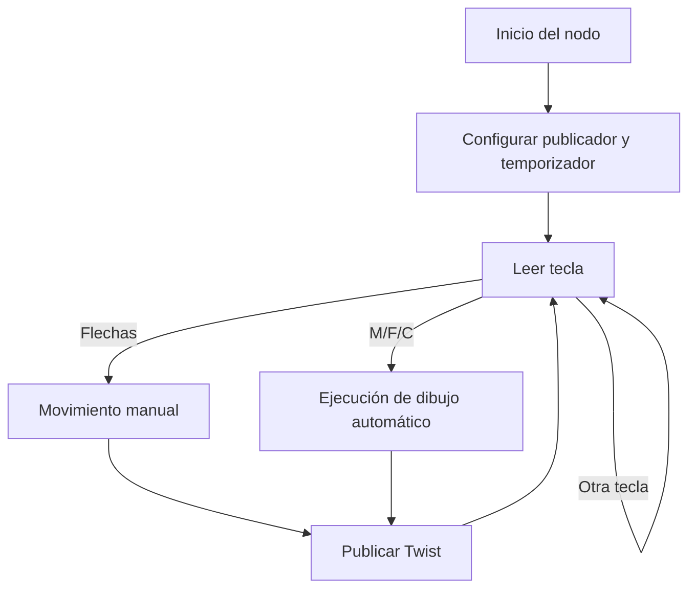

# 🐢 Laboratorio No. 04 – Robótica de Desarrollo
### *Intro a ROS 2 Humble – Turtlesim*

**Integrantes:**  
- David Santiago Nagles Barajas  
- (Nombre del compañero)

## 1. 🧠 Introducción

El paquete **turtlesim** es un simulador liviano incluido en ROS 2 que permite comprender de forma visual los conceptos fundamentales del sistema operativo robótico. Este entorno facilita la experimentación con tópicos, nodos y mensajes sin necesidad de hardware físico.  

En este laboratorio se desarrolla un nodo en Python capaz de controlar la tortuga mediante el teclado, sin utilizar `turtle_teleop_key`. Para ello se implementa:

- un publicador al tópico `/turtle1/cmd_vel`,
- una función de lectura de teclado,
- un temporizador para el ciclo continuo,
- funciones automáticas para dibujar letras.

Las letras corresponden a las iniciales de los integrantes, implementadas totalmente dentro de **move_turtle.py**, cumpliendo las restricciones del laboratorio.

## 2. 🧩 Descripción del desarrollo

### a) Control manual
Mediante la función `get_key()` se leen las flechas del teclado, generando comandos:

- ↑ avanzar  
- ↓ retroceder  
- ← girar a la izquierda  
- → girar a la derecha  

La función `update()` publica mensajes `Twist` cada 0.05 s según la tecla detectada.

### b) Dibujo automático
Las letras **M**, **F** y **C** se implementan como funciones internas en el nodo, controlando rotaciones, movimientos lineales y tiempos.

## 3. 📐 Diagrama de flujo (Mermaid)



## 4. 🐍 Código principal

El código se encuentra en:

```
src/my_turtle_controller/move_turtle.py
```

Fragmento representativo:

```python
class TurtleController(Node):
    def __init__(self):
        super().__init__('turtle_controller')
        self.pub = self.create_publisher(Twist, '/turtle1/cmd_vel', 10)
        self.timer = self.create_timer(0.05, self.update)

    def update(self):
        key = get_key()
        twist = Twist()

        if key == UP:
            twist.linear.x = 2.0
        elif key == DOWN:
            twist.linear.x = -2.0
        elif key == LEFT:
            twist.angular.z = 2.0
        elif key == RIGHT:
            twist.angular.z = -2.0
        elif key == 'm':
            self.draw_M()
        elif key == 'f':
            self.draw_F()
        elif key == 'c':
            self.draw_C()
        else:
            return

        self.pub.publish(twist)
```

## 5. ▶️ Ejecución

```bash
ros2 run turtlesim turtlesim_node
```

```bash
cd ~/ros2_ws
colcon build
source install/setup.bash
ros2 run my_turtle_controller move_turtle
```

## 6. 👁️ Resultados

*(Insertar imágenes de las letras)*

## 7. 🎥 Video

👉 **[Insertar enlace del video]**

## 8. 📝 Conclusiones

- Se comprendió el funcionamiento básico de ROS 2 con Turtlesim.  
- Se implementó control manual y automático desde un único script.  
- Se aplicaron conceptos de cinemática, publicación y lectura de teclado.  
- Se cumplieron todas las restricciones del laboratorio.
